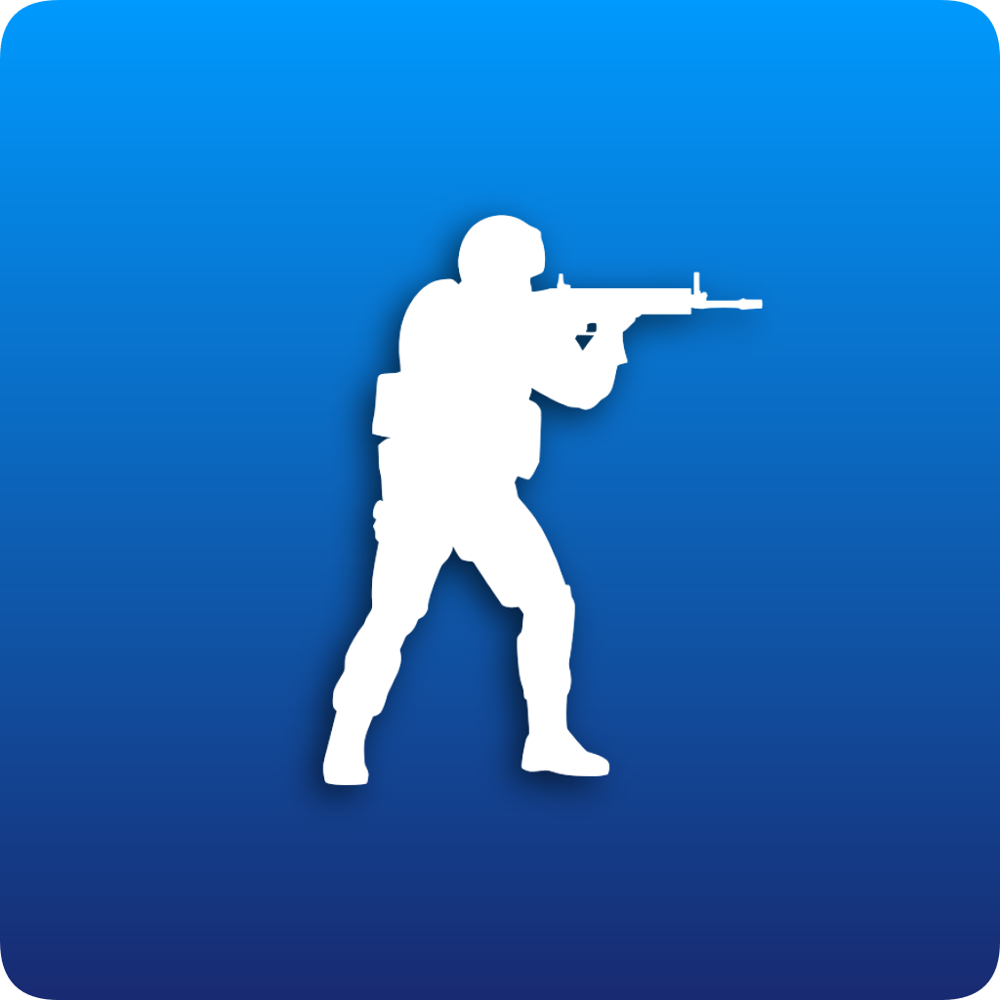

# CS:GO League Bot
CS:GO League discord bot.

This program uses the Discord Python API to manage a bot that manages queues of CS:GO players who want to play against other Discord guild members.

We will post a release once this is ready.

**THIS IS STILL A WORK IN PROGRESS -- IT IS NOT REQUIRED**

# Authors
[Cameron Shinn](https://github.com/cameronshinn) - Developer / Maintainer
[B3none](https://b3none.co.uk/) - Developer
[ThunbergOlle](https://github.com/ThunbergOlle) - Developer

## Watch for releases
So as to keep the latest version of the plugin I recommend watching the repository

## Share the love
If you appreciate the project then please take the time to star our repository.

## Prerequisites
1. discord.py >= 1.2.5
2. dblpy >= 0.3.3

## Installation
To be written.

## Bot Commands
`q!help`: Display help menu  
`q!about`: Display basic info about this bot  
`q!join`: Join the queue  
`q!leave`: Leave the queue  
`q!view`: Display who is currently in the queue  
`q!remove {mention}`: Remove the mentioned user from the queue (Must have server kick perms)  
`q!empty`: Empty the queue (Must have server kick perms)  
`q!pdraft`: Start (or restart) a team draft from the last popped queue  
`q!mdraft`: Start (or restart) a map draft  
`q!popflash`: Link the server's designated PopFlash lobby  
